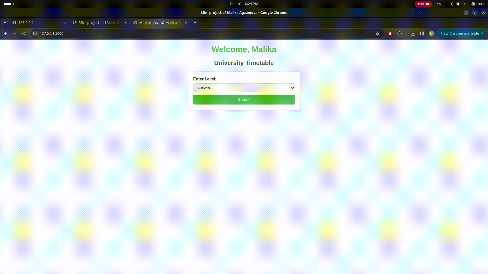
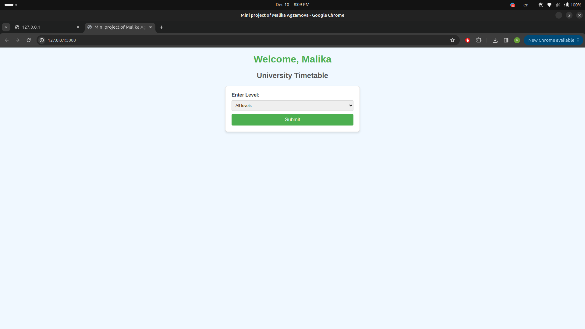
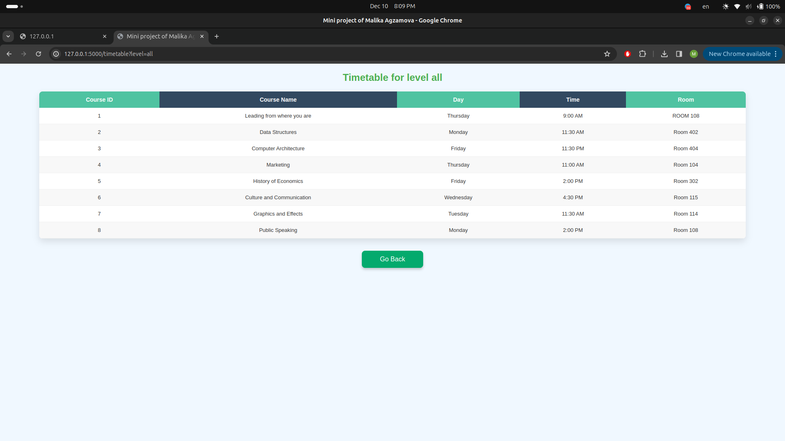

# Docker mini project of Malika Agzamova


Guides

### 1. **Install Docker and start postgresql in Docker**

```bash
docker pull postgres:latest


docker run --name university_db -e POSTGRES_USER=malika -e POSTGRES_PASSWORD=strong_pass -e POSTGRES_DB=malika -d -p 5432:5432 postgres:latest

docker ps

docker exec -it university_db psql -U malika
```


### 2. **Set up the postgresSQL Database and Tables**

```sql
CREATE TABLE Timetable (
    course_id SERIAL PRIMARY KEY,
    course_name VARCHAR(255),
    day VARCHAR(50),
    time VARCHAR(50),
    room VARCHAR(50),
    level INT
);


INSERT INTO Timetable (course_name, day, time, room, level) VALUES
('Leading from where you are ', 'Thursday', '9:00 AM', 'Room 108', 1),
('Data Structures', 'Monday', '11:30 AM', 'Room 402', 1),
('Computer Architecture ', 'Friday', '11:30 PM', 'Room 404', 2),
('Marketing', 'Thursday', '11:00 AM', 'Room 104', 3),
('History of Economics', 'Friday', '2:00 PM', 'Room 302', 2),
('Culture and Communication ', 'Wednesday ', '4:30 PM', 'Room 115', 3),
('Graphics and Effects ', 'Tuesday', '11:30 AM', 'Room 114', 1),
('Public Speaking ', 'Monday', '2:00 PM', 'Room 108', 2);


CREATE TABLE Students (
    student_id SERIAL PRIMARY KEY,
    name VARCHAR(255),
    level INT
);

INSERT INTO Students (name, level) VALUES
('Malika Agzamova', 1),
('Madina Alieva', 2),
('Shakzoda Ibrogimova', 3),
('Maxim Kan', 1);

```

### 3. **Create Virtual Environment and Install Flask and pg8000**
```bash
python3.12 -m venv venv

source venv/bin/activate

pip install flask pg8000

```


### 4. **Create Flask application**

```python
from flask import Flask, render_template, request
import pg8000


app = Flask(__name__, template_folder='templates')


@app.route('/', methods=['GET', 'POST'])
def index():
    if request.method == 'POST':
        level = request.form['level']
        return render_template('timetable.html', level=level)
    return render_template('index.html')


@app.route('/timetable', methods=['GET'])
def timetable():
    level = request.args.get('level')
    conn = pg8000.connect(user='malika', password='strong_pass', host='localhost', database='malika', port=5432)
    cur = conn.cursor()

    query = f"SELECT * FROM timetable WHERE level = {level};"
    cur.execute(query)
    timatables = cur.fetchall()
    print(timatables)

    message = "No timetable found for this level" if not timatables else None
    return render_template('timetable.html', data=timatables, message=message)


if __name__ == '__main__':
    app.run(debug=True)

```

### 5. **Create templates to render**

#### **`index.html` Form for select level**
```html
<!DOCTYPE html>
<html lang="en">
<head>
    <meta charset="UTF-8">
    <meta name="viewport" content="width=device-width, initial-scale=1.0">
    <title>Mini project of Malika Agzamova</title>
    <style>
        body {
            font-family: Arial, sans-serif;
            margin: 0;
            padding: 0;
            background-color: #f0f8ff;
            color: #333;
        }

        h1 {
            text-align: center;
            color: #4caf50;
            margin-top: 20px;
        }

        h2 {
            text-align: center;
            color: #555;
        }

        form {
            max-width: 400px;
            margin: 20px auto;
            padding: 20px;
            background: #fff;
            border: 1px solid #ddd;
            border-radius: 8px;
            box-shadow: 0 4px 6px rgba(0, 0, 0, 0.1);
        }

        label {
            display: block;
            margin-bottom: 8px;
            font-weight: bold;
        }

        select {
            width: 100%;
            padding: 8px;
            margin-bottom: 10px;
            border: 1px solid #ccc;
            border-radius: 4px;
        }

        button {
            display: block;
            width: 100%;
            padding: 10px;
            background-color: #4caf50;
            color: white;
            border: none;
            border-radius: 4px;
            cursor: pointer;
            font-size: 16px;
        }

        button:hover {
            background-color: #45a049;
        }
    </style>
</head>
<body>
    <h1>Welcome, Malika</h1>
    <h2>University Timetable</h2>
    <form method="GET" action="/timetable">
        <label for="level">Enter Level:</label>
        <select name="level" id="level">
            <option value="all">All levels</option>
            
            <option value="{{ level[0] }}">Level {{ level[0] }}</option>
            
        </select>
        <button type="submit">Submit</button>
    </form>
</body>
</html>

```

#### **`timetable.html` Displaying Timetables**

```html
<!DOCTYPE html>
<html lang="en">
<head>
    <meta charset="UTF-8">
    <meta name="viewport" content="width=device-width, initial-scale=1.0">
    <title>Mini project of Malika Agzamova</title>

</head>
<body>
    <h1>Timetable for level {{ level }}</h1>

    
    <div class="table-wrapper">
        <table class="fl-table">
            <thead>
                <tr>
                    <th>Course ID</th>
                    <th>Course Name</th>
                    <th>Day</th>
                    <th>Time</th>
                    <th>Room</th>
                    <th>Level</th>
                </tr>
            </thead>
            <tbody>
                
                <tr>
                    <td>{{ row[0] }}</td>
                    <td>{{ row[1] }}</td>
                    <td>{{ row[2] }}</td>
                    <td>{{ row[3] }}</td>
                    <td>{{ row[4] }}</td>
                    <td>{{ row[5] }}</td>
                </tr>
                
            </tbody>
        </table>
    </div>
    
    <p>{{ message }}</p>
    

    <a href="/" class="back-button">Go Back</a>
</body>
</html>

<style>
        * {
            box-sizing: border-box;
        }

        body {
            font-family: Helvetica, Arial, sans-serif;
            margin: 0;
            padding: 0;
            background: #f0f8ff;
            color: #333;
        }

        h1 {
            text-align: center;
            color: #4caf50;
            margin: 20px 0;
            font-size: 24px;
        }

        .table-wrapper {
            margin: 20px auto;
            max-width: 90%;
            overflow-x: auto;
            background: #fff;
            border-radius: 8px;
            box-shadow: 0px 8px 16px rgba(0, 0, 0, 0.1);
        }

        .fl-table {
            width: 100%;
            border-collapse: collapse;
            background-color: white;
            border-radius: 8px;
            overflow: hidden;
        }

        .fl-table th, .fl-table td {
            text-align: center;
            padding: 12px 16px;
        }

        .fl-table th {
            background: #324960;
            color: white;
            font-size: 14px;
        }

        .fl-table th:nth-child(odd) {
            background: #4FC3A1;
        }

        .fl-table td {
            font-size: 13px;
            border-bottom: 1px solid #f0f0f0;
        }

        .fl-table tr:nth-child(even) {
            background: #f8f8f8;
        }

        .back-button {
            display: block;
            width: 150px;
            margin: 30px auto;
            padding: 12px 24px;
            font-size: 16px;
            color: white;
            background-color: #04AA6D;
            border: none;
            border-radius: 8px;
            cursor: pointer;
            text-align: center;
            text-decoration: none;
            box-shadow: 0px 4px 6px rgba(0, 0, 0, 0.2);
            transition: all 0.3s ease;
        }

        .back-button:hover {
            background-color: #036d49;
            transform: scale(1.05);
        }

        .back-button:active {
            background-color: #025b3c;
            transform: scale(1);
        }

    </style>
```

### 6. **Running the Flask App**
```bash
python3 app.py
```

### 7. **Navigate to browser to check results**
```
 Running on http://127.0.0.1:5000
```

### 8. **Presenting results**




### 9. **Stop running docker container**
```bash
docker stop university_db
```